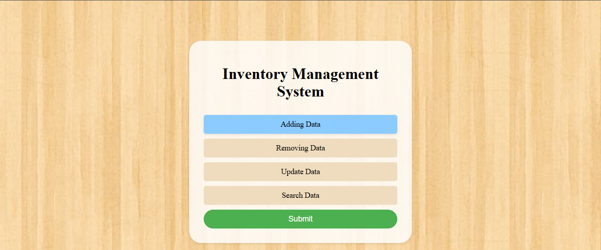
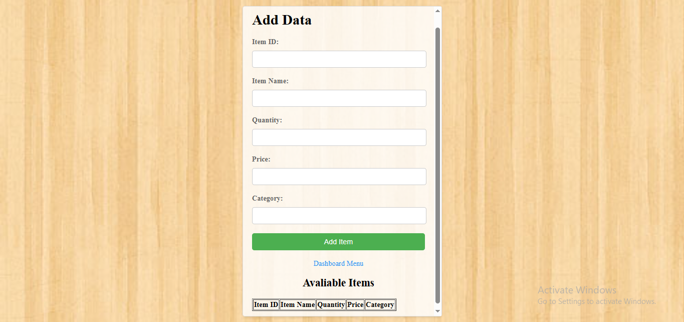
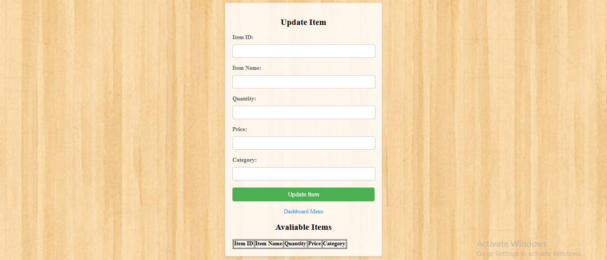

# Inventory Management System

An **end-to-end Inventory Management System** deployed on **PythonAnywhere**, built with **Python (Flask)**, **MySQL**, and frontend technologies (**HTML, CSS, JavaScript**).
This system allows users to **add, remove, update, and search inventory items** efficiently, making it suitable for various applications like retail, warehouses, or small businesses.

---

## Features

1. **Add Items**
   Users can add new items to the inventory with details like Item ID, Name, Quantity, Price, and Category.
   

2. **Remove Items**
   Delete items from the inventory by entering the Item ID. Prevents deletion if the item does not exist.
   

3. **Update Items**
   Update item details such as Name, Quantity, Price, or Category. Only the fields provided will be updated.
   

4. **Search Items**
   Search for inventory items using Item ID, Name, or Category. Returns matching results dynamically.
   

5. **View All Records**
   Provides a complete overview of the inventory in a clean, tabular format on the dashboard.

---

## Technology Stack

* **Backend:** Python, Flask
* **Database:** MySQL
* **Frontend:** HTML, CSS, JavaScript
* **Deployment:** PythonAnywhere

---

## System Behavior

* **Add:** Validates input to ensure all fields are filled and quantity/price are numeric. Checks for duplicate Item IDs.
* **Remove:** Validates existence before deletion to avoid errors.
* **Update:** Only updates provided fields; numeric validation for quantity and price.
* **Search:** Flexible search using exact or partial matches. Returns results dynamically.
* **Dashboard:** Central hub for managing and viewing inventory.

---

## How It Works

1. User accesses the **dashboard**.
2. Chooses an operation: **Add, Remove, Update, Search**.
3. The system validates input and interacts with **MySQL database** to reflect changes.
4. User receives feedback via frontend alerts for each operation.

---

## Deployment

The project is deployed on **PythonAnywhere**, making it accessible online with persistent MySQL storage.

---

## Usage

1. Navigate to the dashboard URL.
2. Perform any inventory operations using the intuitive UI.
3. View and manage inventory in real-time.

---

**All Rights Reserved 2025 @mess.ai**

---

